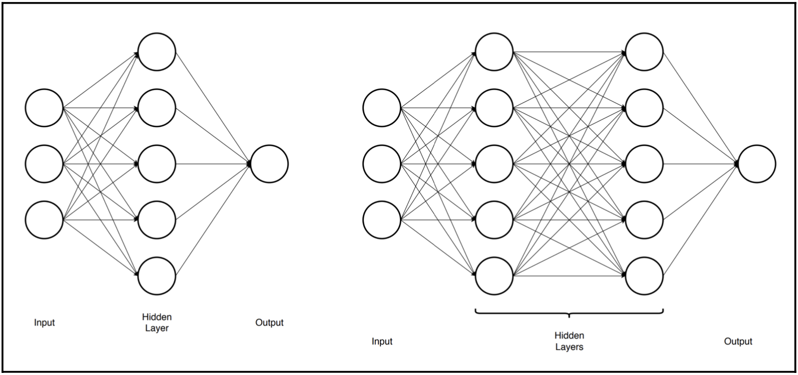
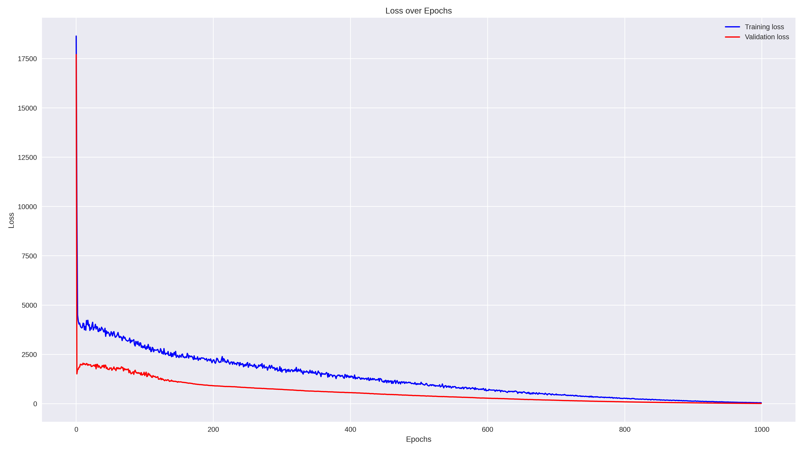
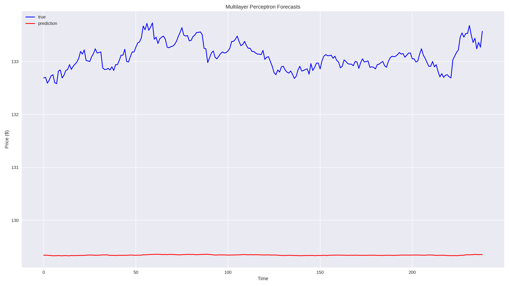
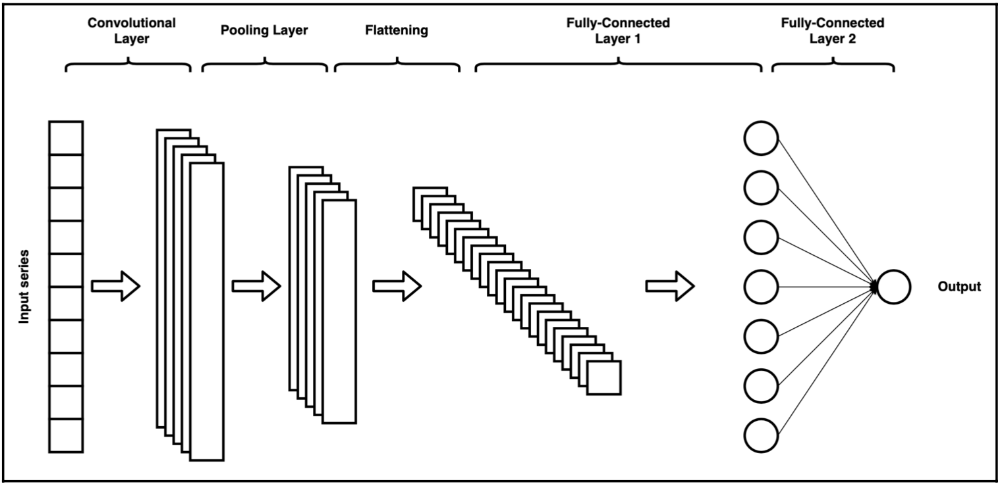
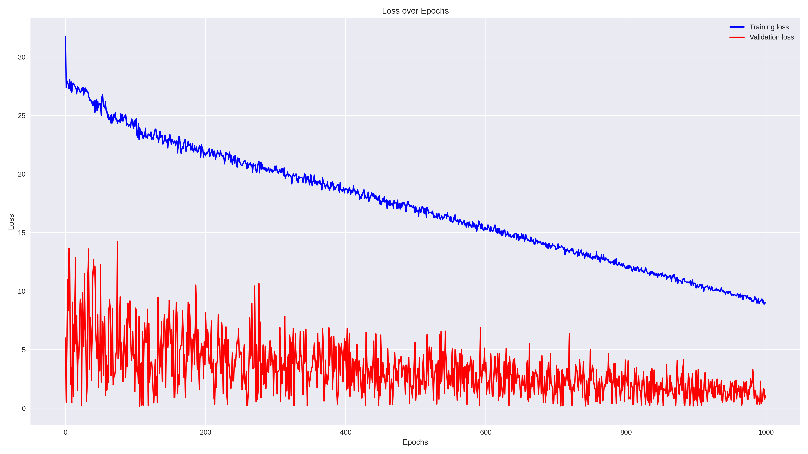
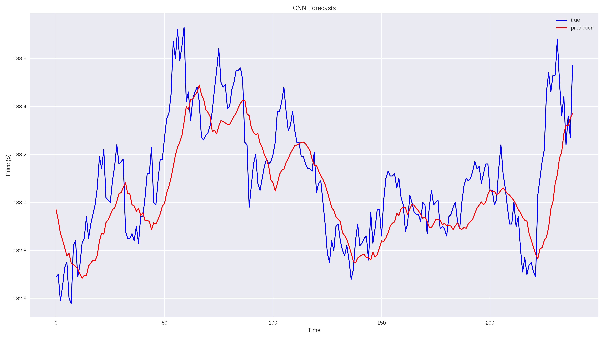
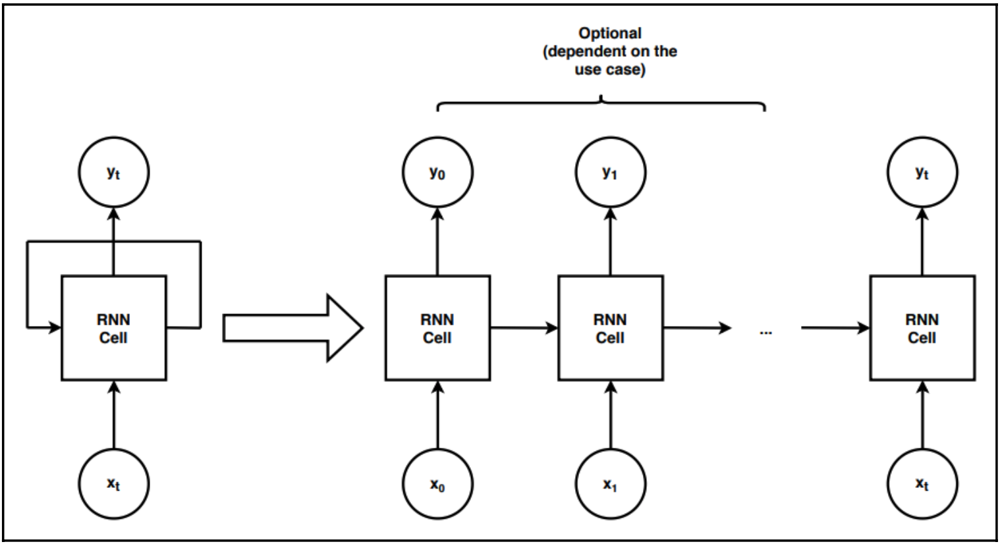
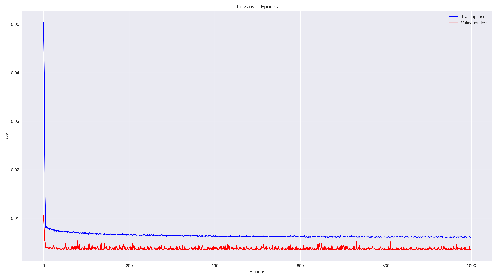
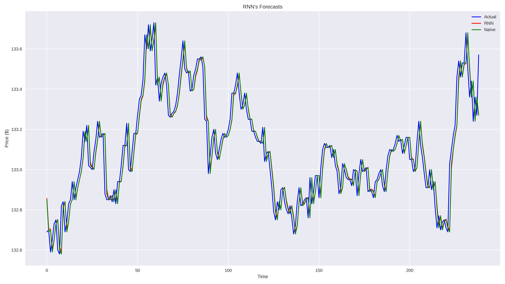

# AI for Finance - High Frequency Forecasting

# Table of Content
1. [**_Introduction_**](#1-introduction)
2. [**_Data_**](#2-data)
3. [**_Multi Layer Perceptron_**](#3-multi-layer-perceptron-mlp)
   1. [_Architecture_](#31-mpl-architecture)
   2. [_Losses_](#32-mlp-losses)
   3. [_Prediction_](#33-mlp-prediction)
4. [**_Convolutional Neural Network_**](#4-convolutional-neural-network-cnn)
   1. [_Architecture_](#41-cnn-architecture)
   2. [_Losses_](#42-cnn-losses)
   3. [_Prediction_](#43-cnn-prediction)
5. [**_Recurrent Neural Network_**](#5-recurrent-neural-network-rnn)
   1. [_Architecture_](#51-rnn-architecture)
   2. [_Losses_](#52-rnn-losses)
   3. [_Prediction_](#53-rnn-prediction)
6. [**_Conclusion_**](#6-conclusion)

# 1. Introduction
In recent years, we have been the audience of a series of increasingly successful achievements of deep learning 
techniques. 
Deep neural networks were applied to tasks in which traditional machine learning algorithms wouldn't stand a chance – 
large-scale image classification, autonomous driving, and many others. Almost yearly, we can observe the introduction 
of a ri-visitation of some previous network architecture which makes it achieve state-of-the-art results on a specific 
task.
With the constant improvement in commercially available Graphics Processing Units (GPU), the emergence of freely 
available processing power involving CPUs/GPUs (Google Colab, Kaggle, and so on) and the rapid development of different 
frameworks, deep learning continues to gain more and more attention amongst researchers and practitioners who want to 
apply the techniques to their business cases.\
Deep learning proved to deliver great results with sequential data such as speech, audio, and video. 
That is why it naturally fits into working with sequential data such as time series—both univariate and multivariate. 
Financial time series are known to be erratic and complex, hence the reason why it is such a challenge to model them. 
Deep learning approaches are especially apt for the task, as they make no assumptions about the distribution of the 
underlying data and can be quite robust to noise.

In this final project, we are going to show one possible use case of deep learning in the financial domain – **forecasting** 
**high frequency time series**. For achieving this very specific - yet extremely flattering - field of application we 
focus on introducing three different approaches for time series forecasting. 
In particular, we provide a recipe for a [**Multi Layer Perceptron**](#3-multi-layer-perceptron-mlp), a 
[**Convolutional Neural Network**](#4-convolutional-neural-network-cnn), and a [**Recurrent Neural Network**](#5-recurrent-neural-network-rnn). 
In the [Conclusions'](#6-conclusions) paragraph we will sum up performances and results of 
each and every architecture with the aim of understanding which is the most suitable for time series forecasting.

💡**TIP 1**: for the best experience please run notebooks on [GoogleColab](https://colab.research.google.com/)! \
💡**TIP 2**: to save time and resources we also provide checkpoints for each training session. You can find them all in 
the [`checkpoints`](checkpoints) directory! \
ℹ️**NOTE**: the complete code is available in the repository on [GitHub](https://github.com/aambroo/AI4Finance).


# 2. Data
Data used in this project are retrieved from the [Refinitiv's Eikon](https://www.refinitiv.com/en) platform 
(temporary subscription plan kindly provided by the [University of Trento](https://www.unitn.it/en)).

We extracted a historical list of daily prices with one minute frequency for the Apple (ticker: `AAPL`). 
Underneath is an example of the preprocessed dataframe structure:

[//]: # (dataframe table)
<table border="1" class="dataframe">
  <thead>
    <tr style="text-align: center;">
      <th>datetime</th>
      <th>Close</th>
      <th>%Chg</th>
      <th>Volume</th>
    </tr>
  </thead>
  <tbody>
    <tr style="text-align: center;">
      <th>19:00:00</th>
      <td>131.040000</td>
      <td>1.345673e-03</td>
      <td>152201.0</td>
    </tr>
    <tr style="text-align: center;">
      <th>18:59:00</th>
      <td>130.863900</td>
      <td>-2.757830e-04</td>
      <td>82634.0</td>
    </tr>
    <tr style="text-align: center;">
      <th>18:58:00</th>
      <td>130.900000</td>
      <td>3.667056e-05</td>
      <td>90831.0</td>
    </tr>
    <tr style="text-align: center;">
      <th>18:57:00</th>
      <td>130.895200</td>
      <td>4.310648e-04</td>
      <td>90186.0</td>
    </tr>
    <tr style="text-align: center;">
      <th>18:56:00</th>
      <td>130.838800</td>
      <td>-4.766954e-04</td>
      <td>113039.0</td>
    </tr>
    <tr style="text-align: center;">
      <th>18:55:00</th>
      <td>130.901200</td>
      <td>8.556803e-05</td>
      <td>105691.0</td>
    </tr>
    <tr style="text-align: center;">
      <th>...</th>
      <td>...</td>
      <td>...</td>
      <td>...</td>
    </tr>
  </tbody>
</table>


# 3. Multi Layer Perceptron (MLP)
Multi layer perceptrons (MLP) are one of the basic architectures of neural networks. At a very high level, they consist 
of three components:
- _input layer_: A vector of features.
- _hidden layers_: Each hidden layer consists of N neurons.
- _output layer_: Output of the network; depends on the task (regression/classification).

The input of each hidden layer is first transformed linearly (multiplication by weights and adding the bias term) 
and then non-linearly (by applying activation functions such as ReLU). Thanks to the non-linear activation, the network 
is able to model complex, non-linear relationships between the features and the target.
A multilayer perceptron contains multiple hidden layers (also called dense layers or fully connected layers) stacked 
against each other. 
Beneath is a diagram presenting a network with a single hidden layer and an MLP with two layers:



Workflows concerning data preprocessing, data preparation (data-loaders, data-splitters), and plotting methods are 
shared by all recipes. What differs is, of course, the networks' architecture.

```python
class MLP(nn.Module):
  def __init__(self, input_size):
      super(MLP, self).__init__()
      self.linear1 = nn.Linear(input_size, 8)
      self.linear2 = nn.Linear(8, 4)
      self.linear3 = nn.Linear(4, 1)
      self.dropout = nn.Dropout(p=0.2)

  def forward(self, x):
    x = self.linear1(x)
    x = F.relu(x)
    x = self.dropout(x)
    x = self.linear2(x)
    x = F.relu(x)
    x = self.dropout(x)
    x = self.linear3(x)
    return x
```

Multi layer perceptron's architecture is fairly simple. It is made up of three linear hidden layers of size `(input_size x 8)`, 
`(8 x 4)`, `(4 x 1)` respectively, and an output layer. Non-linearities are placed in between linear layers, and they 
are ReLUs. Dropout is a technique for reducing overfitting. 

### 3.1. MPL Architecture
There are two approaches to defining networks in PyTorch and, in this section, we present the one based on defining a 
class, which inherits from `nn.Module`. By inheriting, we mean that it will automatically possess a series of required 
methods, and we only need to define a few selected ones (we can also overwrite the default methods if there is such a 
need). The first method is the `__init__` method, in which we store all the operations that we want to carry out. As a 
rule, we should store all the trainable operations here such as fully connected layers (`Linear`), and the `dropout` 
layer with its assigned.

    MLP(
      (linear1): Linear(in_features=1, out_features=8, bias=True)
      (linear2): Linear(in_features=8, out_features=4, bias=True)
      (linear3): Linear(in_features=4, out_features=1, bias=True)
      (dropout): Dropout(p=0.2, inplace=False)
    )

ℹ️ [Here](https://en.wikipedia.org/wiki/Dilution_(neural_networks)) you can find an in depth explanation of how dropout works.

### 3.2. MLP Losses

### 3.3. MLP Prediction



# 4. Convolutional Neural Network (CNN)
Convolutional Neural Networks (CNN) were developed and remained very popular in the image classification domain. 
However, they can also be applied to 1-dimensional problems, such as predicting the next value in a sequence, be it a 
time series or the next word in a sentence. \
The elements that constitute a typical CNN architecture are as follows:
- _convolutional layer_: The goal of this layer is to apply convolutional filtering to extract potential features.
- _pooling layer_: This layer reduces the size of the image or series while preserving the important characteristics 
identified by the convolutional layer.
- _fully connected layer_: Usually, there is more than one fully connected layer at the end of the network to map features 
into classes or values.

In the following diagram, we present a simplified schema of a mono-dimensional CNN:



```python
class Flatten(nn.Module):
  def forward(self, x):
      return x.view(x.size()[0], -1)
model = nn.Sequential(OrderedDict([
    ('conv_1', nn.Conv1d(1, 32, 3, padding=1)),
    ('max_pool_1', nn.MaxPool1d(2)),
    ('relu_1', nn.ReLU()),
    ('flatten', Flatten()),
    ('fc_1', nn.Linear(192, 50)),
    ('relu_2', nn.ReLU()),
    ('dropout_1', nn.Dropout(0.4)),
    ('fc_2', nn.Linear(50, 1))
]))
```

### 4.1. CNN Architecture
The general outline of the training loop is very similar to the one used in the previous recipe, so we only describe 
the novelties. Within the training loop, we had to reshape the features/targets coming from the DataLoader objects. 
That is because `nn.Conv1d` expects a 3-dimensional input, with the dimensions being _number of batches_, 
_channels_, _length of series_. Alternatively, we could have defined a custom Dataset/DataLoader, which would have 
returned the inputs of the correct size. For this recipe, we used the RMSE as the loss function simply by extracting
the square root of MSE through `torch.sqrt`. 

    Sequential(
      (conv_1): Conv1d(1, 32, kernel_size=(3,), stride=(1,), padding=(1,))
      (max_pool_1): MaxPool1d(kernel_size=2, stride=2, padding=0, dilation=1, ceil_mode=False)
      (relu_1): ReLU()
      (flatten): Flatten()
      (fc_1): Linear(in_features=192, out_features=50, bias=True)
      (relu_2): ReLU()
      (dropout_1): Dropout(p=0.4, inplace=False)
      (fc_2): Linear(in_features=50, out_features=1, bias=True)
    )

ℹ️ **NOTE**: you can find more about CNNs [here](https://en.wikipedia.org/wiki/Convolutional_neural_network).

### 4.2. CNN Losses

### 4.3. CNN Prediction



# 5. Recurrent Neural Network (RNN)
Recurrent Neural Networks (RNNs) are a special type of neural network designed to work with sequential data. They are 
popular for time series forecasting as well as for solving NLP problems such as machine translation, text generation, 
and speech recognition. There are numerous extensions of the RNNs, such as Long-Short Term Memory (LSTM) networks and 
Gated Recurrent Unit (GRU) networks, which are currently holding the state-of-the-art title. \
The following diagram shows a typical vanilla RNN schema:


```python
class RNN(nn.Module):
  def __init__(self, input_size, hidden_size, n_layers, output_size):
    super(RNN, self).__init__()
    self.rnn = nn.RNN(input_size, hidden_size,
                      n_layers, batch_first=True,
                      nonlinearity='relu')
    self.fc = nn.Linear(hidden_size, output_size)

  def forward(self, x):
    output, _ = self.rnn(x)
    output = self.fc(output[:, -1, :])
    return output
```

The network architecture adopted in this section features six neurons in the hidden layer, one RNN layer, and returns 
one feature as output. As loss function we use both Mean Squared Error (MSE) and Root Mean Squared Error (RMSE). We use
Adam as the optimizer.

### 5.1 RNN Architecture
    RNN(
      (rnn): RNN(1, 6, batch_first=True)
      (fc): Linear(in_features=6, out_features=1, bias=True)
    )
### 5.2. RNN Losses

### 5.3. RNN Prediction



# 6. Conclusion
To sum up, the three recipes proposed in this project aim at achieving the same results with different strategies. \
In the previous projects ([Project 3](../Project3), [Project 4](../Project4), and [Project 5](../Project5)) we used 
regression techniques to perform tasks strictly related to prediction. In this final project we finally introduce 
deep learning techniques to perform high frequency predictions for 12 periods (meaning 12 minutes) in advance. 

MLP shows not enough explanatory power for such a task. Its prediction of the time series, due entirely to its linear 
constraints, is a straight line (see [_MLP Prediction_](#33-mlp-prediction)). And it is not sufficient for high frequency 
forecasting.

CNN, on the other hand, does a pretty good job predicting the overall development of the price changes. It happens on a 
smoother curve compared to the ground truth, hence sparks are approximated with curved local maximum and local minimum
peaks (see [_CNN Prediction_](#43-cnn-prediction)). Unfortunately, such a model could never be of help in the real world scenario. The general development of the
cost curve is not interesting, what is interesting instead is to **sharply** predict the value of a price several 
periods in advance. \
Approaches for more advanced CNN models are out there already and one is called _multi-headed models_. The underlying 
idea is to train different specifications of the convolutional parts of the network, concatenate them at the flattening 
stage, and feed the joined output to the fully connected layer(s). The main benefit of using multi-headed models is the 
flexibility they provide, which (depending on the use case) can result in a substantial boost in performance.

RNN's prediction is stunningly impressive. It looks almost a perfect replica of the ground truth (see [_RNN Prediction_](#53-rnn-prediction)).
Despite its fairly simple architecture, the model provides proof of evidence of its remarkable explanation power 
for time series forecasting whenever compared to its colleagues MLP and CNN. 

I would like to conclude with a central theorem of machine learning which - to me - is as granted as meaningful: 
the **_No Free Lunch Theorem_** (Wolpert, 1996) which basically states that **_no machine learning algorithm is universally
any better than any other_**. The most sophisticated algorithm we can conceive of has the same average performance 
(over all possible tasks) as merely predicting that every point belongs to the same class. \
All this to say that RNN might excel in tasks such as series forecasting, but may be cancelled out by a CNN in an image 
classification task.
